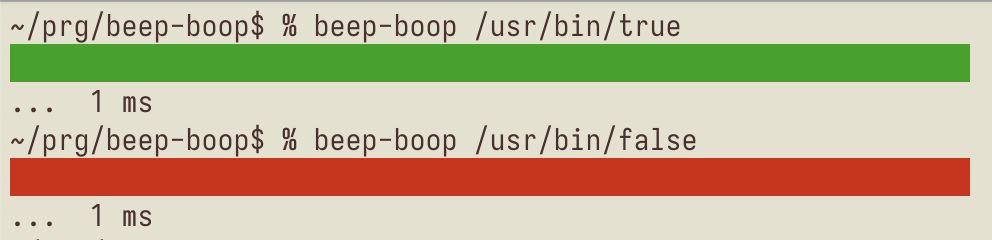

# beep-boop 🤖

** Audiovisual feedback for test runs, simplified**



🎶 plays a pleasant sound if your tests succeed and a melancholy one if they fail

## Installation

```
git clone https://github.com/pesterhazy/beep-boop
cd beep-boop
npm install .
```

## Usage

```
beep-boop --version
```

Typically `beep-boop` is used as a prefix command wrapping your test runner:

```
watchexec -- beep-boop npm test
```

or 

```
watchexec -- beep-boop lein test
```

Turn your audio volume up so you can hear the sound effect! On macOS you'll also see a temporary display notification with a red or green icon.

`beep-boop` works by inspecting the exit status of the command it wraps, so you can easily try it like this:

```
beep-boop /usr/bin/true
beep-boop /usr/bin/false
```
